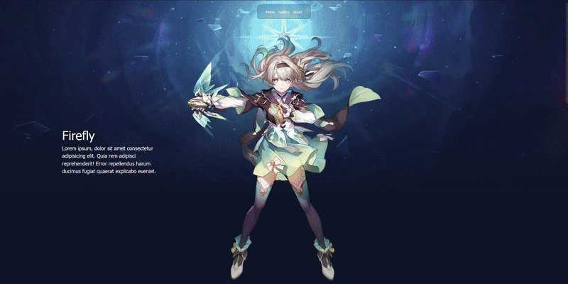

## Firefly-Presentation

This project just presents a character for Honkai: Star Rail.

### ⛔This web site dont support mobile resolution⛔



## Libraries and Frameworks Used

- **React**: A JavaScript library for building user interfaces.
- **Vite**: A fast build tool and development server for modern web projects.
- **Tailwind CSS**: A utility-first CSS framework for styling.
- **Framer Motion**: A JavaScript library for animation.
- **React Hooks**: Used for state management (`useState`, `useEffect`).

## How to Download and Run the Program

Follow these steps to download and run the application locally:

1. **Clone the Repository**:
   ```bash
   git clone <repository-url>
2. **Navigate to the Project Directory**:
   ```bash
   cd <project-directory>
   ```
3. **Install Dependencies**:
   ```bash
   npm install
   ```
4. **Start the Development Server**:
   ```bash
    npm run dev
    ```
